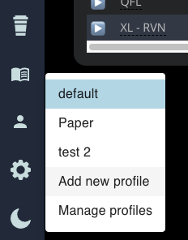

# Profiles

## What are profiles?

Profiles are a way to "quick save" your currency/account information and switch between them in the application. They also provide the ability to have multiple 3Commas accounts included in the application.

With the addition of profiles, you can now run multiple instances of the application that each uses a different profile!

## Managing Profiles

We have tried to make profile management as simple as possible. If anything is unclear don't hesitate to reach out! 

### Creating:

1. Within the application hover over the person icon on the bottom left and click "Add new profile"  
2. This will direct you to a blank settings page where you can configure your new profile!
   * **Tip: Be sure to name your profile something that tells you exactly what it is.**
3. Fill out the API data and select a mode. Then be sure to click "Test API Keys"
   * You can use the same API keys for multiple profiles if you want.
   * You can use different keys attached to **different** 3Commas accounts as well!
4. Configure the Stat / Metric currency. This currency is used to filter **all the data** within the 3c Portfolio Manager application.
5. Enable an account to use, and select a start date for your data.
6. Click **Save Profile**. This will download all the information from 3Commas for that profile. This may take a few minutes.

### Editing:

Editing the profile requires you to make it your active profile temporarily, but this will be improved in later releases!

1. Use the person icon to switch to the profile you'd like to edit. If you're already on that profile skip this step.
2. Click the settings cog to navigate into the profile settings.
3. Edit any settings you wish, then click **Save Profile**. 
   * Saving the profile will again sync data from 3Commas, which has been updated since the last sync. Give this a moment to complete. 

### Deleting:

We have two ways to delete a profile within the app

#### Delete the active profile:

1. Use the person icon to switch to the profile you'd like to delete. If you're already on that profile skip this step.
2. Click the settings cog to navigate to the profile settings.
3. Click the **Delete Profile** button. 
   * This will delete **all the profile information** and you will have to configure this profile again if you want it.

#### Delete an inactive profile:

1. Hover over the person icon and select **Manage Profiles**
2. Click the delete icon next to any profile you wish to completely delete.
   * This will delete **all the profile information** and you will have to configure this profile again if you want it.

## Profiles Help:

### Issues with syncing to 3Commas after upgrading from v0.4.1 or lower.

The config migration script can have an issue when upgrading to v1. To fix this you may need to delete the auto-generated profile and rebuild it. Follow the steps below.

1. Follow the [Create profile steps](profiles.md#creating)
2. Once you saved the profile it'll now switch back to the default profile that has the bug. 
3. Hover over the person icon and click **Manage Profiles**
4. Now delete the profile that it creates automatically \(Named "Default"\).
5. Close the profile manage screen, open the Stats page and click the refresh button.

