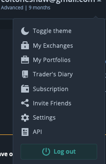

# Initial Setup

1. Download the latest release from GitHub [here](https://github.com/coltoneshaw/3c-portfolio-manager/releases).
   * Depending on how you're downloading this file you could get an unsafe file warning. For more information read [Why should I trust this?](./#why-should-i-trust-this) and [Unsafe File Warning](./#unsafe-file-warning).
   * Scroll to the bottom of the latest release and you'll find the download links under `Assets`.
2. Run the installer on your computer \(or a local VM\)
3. Generate API keys within 3Commas. **These are not your exchange keys**
   1. Log into [3commas.io](www.3commas.io)
   2. Click on your email in the top right then API  
   3. Click **Add API Access Token**
   4. Add all three read only permissions.
4. Add your API keys to the 3C Portfolio Manager in Settings and click run `Test API keys`
   * This will download your exchange accounts directly from 3Commas.
5. Choose a filter currency, the start date, and enable an account.
   * If you have funds in your account that you **do not** want to be used in calculations add that to the `Reserved Bankroll` field
6. Click Save. 
   1. This will download the deal data, bots, and account information from 3commas. This can take anywhere from 30 seconds to 5 minutes.
7. Start to profit!

