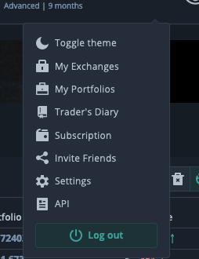

# Initial Setup

1. Download the latest release from [GitHub](https://github.com/coltoneshaw/3c-portfolio-manager/releases/)
   * Depending on how you're downloading this file you could get an unsafe file warning. For more information read [Why should I trust this?](./#why-should-i-trust-this) and [Unsafe File Warning](./#unsafe-file-warning).
   * You'll find the download links under `Assets`.
2. Run the installer on your computer \(or a local VM\)
3. Generate API keys from 3Commas. **These are not the same as your exchange keys**
   1. Go to [3commas.io](www.3commas.io)
   2. Top right click your email &gt; API Keys 
   3. Click "New API Access Token"
   4. Select all three **read-only** properties.
   5. Save and use in the next step
4. Add your API keys to the application, run `Test API keys`
   * This will download your accounts and confirm the API keys are valid. 
5. Choose a filter currency, the start date, and enable an account.
   * If you have funds in your account that you **do not** want to be used in calculations add that to the `Reserved Bankroll` field
6. Click Save. 
   * This will download the deal data, bots, and account information from 3commas. This can take anywhere from 15 seconds to 4 minutes.
7. Start to profit

